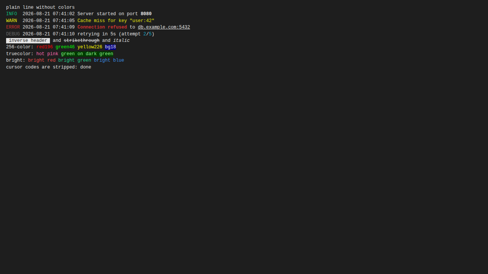

#  Log Colorizer

A browser extension for **Chrome** and **Firefox** that colorizes ANSI escape
codes in plain text log files.

When the browser opens a `.txt` or `.log` file, it renders the raw text into a
native `<pre>` tag — including all the `ESC[31m`-style ANSI color codes as
plain characters. This extension reacts **on a toolbar click only**: it takes
the text content of the current page, parses the ANSI codes, builds a
colorized DOM and replaces the page content with it. Clicking the toolbar
button a second time restores the original page.



## Supported ANSI codes

- Basic foreground/background colors (`30–37`, `40–47`) and their bright
  variants (`90–97`, `100–107`)
- 256-color mode (`38;5;n`, `48;5;n`) and 24-bit truecolor (`38;2;r;g;b`,
  `48;2;r;g;b`)
- Bold, dim, italic, underline, strikethrough, inverse, hidden and blink,
  plus their reset counterparts and full reset (`0`)
- All other escape sequences (cursor movement, erase, OSC titles, …) are
  stripped from the output

## Project layout

```
src/colorize.js       Shared content script: ANSI parser + DOM builder + toggle
src/background.js     Shared background script: injects colorize.js on click
chrome/manifest.json  Chrome Manifest V3 (background service worker)
firefox/manifest.json Firefox Manifest V3 (background event page + gecko id)
icons/                Generated icons (see scripts/generate-icons.py)
build.sh              Assembles dist/chrome and dist/firefox (+ zips)
sample.log            Test file containing all supported ANSI codes
```

## Build

```sh
./build.sh
```

This creates `dist/chrome/` and `dist/firefox/` (plus a zip of each) by
combining the shared code from `src/` and `icons/` with the browser-specific
manifest.

## Install

### Chrome

1. Run `./build.sh`
2. Open `chrome://extensions`
3. Enable **Developer mode** (top right)
4. Click **Load unpacked** and select the `dist/chrome/` directory
5. To use it on local files (`file:///...`), open the extension's details
   and enable **Allow access to file URLs**

### Firefox

1. Run `./build.sh`
2. Open `about:debugging#/runtime/this-firefox`
3. Click **Load Temporary Add-on…** and select `dist/firefox/manifest.json`
   (or the built `dist/log-colorizer-firefox.zip`)

## Try it

Open the bundled
[`sample.log`](https://raw.githubusercontent.com/christoph-jerolimov/log-colorizer-browser-extension/main/sample.log)
(raw GitHub link, rendered as plain text by the browser) and click the
Log Colorizer toolbar button. Click again to get the original raw text
back. Alternatively drag & drop the local [`sample.log`](sample.log)
into a tab or serve it over HTTP.

## How it works

1. The toolbar click fires `chrome.action.onClicked` in the background
   script — the extension needs only the `activeTab` and `scripting`
   permissions, so it can't read any page until you click.
2. The background script injects `colorize.js` into the active tab.
3. `colorize.js` grabs the text from the page's `<pre>` tag, tokenizes it
   with a regex that matches ANSI escape sequences, tracks the current SGR
   style state (colors, bold, underline, …) and emits a `<span>` with inline
   styles for every styled chunk of text.
4. The original `<pre>` is swapped for the colorized one (and kept in memory,
   so a second click swaps it back).
